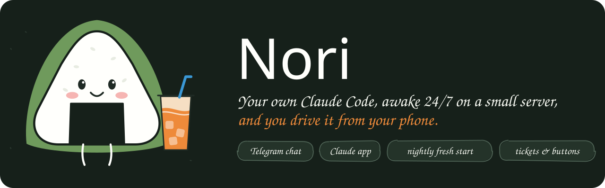
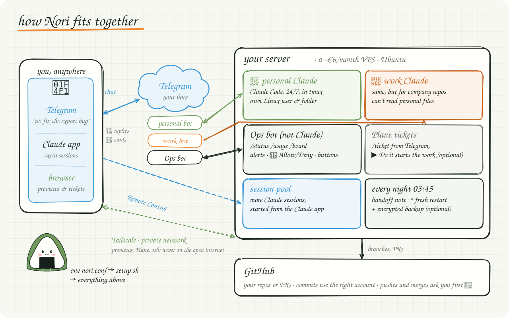
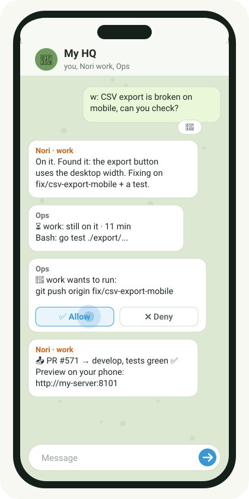

<p align="center">
  
</p>

# Nori 🍙

**Your own Claude Code, running 24/7 on a ~€6/month server, that you talk to from Telegram.**

Send "fix the export bug" from the bus. Claude works on your server while your laptop is closed, asks before it pushes (one tap: ✅ Allow), opens the PR and sends you a preview link. Your repos, your Claude subscription, your server.

### 🔒 Security at a glance
- **Your keys stay yours:** typed hidden, sent only to your own server, never saved on your laptop, in git or in a chat.
- **Your server is locked down:** firewall closed except key-only SSH and private Tailscale; each Claude runs as its own user without sudo.
- **Risky actions ask you first:** pushes and merges always need your 🔐 tap, even in auto mode.
- **What it can't protect:** whoever gets into your Telegram account can make Claude run code on your server, so turn on Telegram two-step verification. Bot chats aren't end-to-end encrypted.
- Found a problem? Report it privately ([SECURITY.md](SECURITY.md)). Details: [docs/security.md](docs/security.md).

## Start
You need [Claude Code](https://docs.claude.com/en/docs/claude-code). Then:
```
git clone https://github.com/northpr/nori && cd nori && claude
```
and say **hi Nori**. Nori (the guide in `CLAUDE.md`) asks a few questions in English or Thai, writes your config, and sets up the server with you, step by step (or in one go with `./nori up`). Questions at any point? Just ask Nori.

On a Mac, the first `git` may show a popup to install Apple's developer tools: click Install (about 5 min, free), then run it again.

## How it fits together
<p align="center">
  
</p>

<table>
<tr>
<td width="320" valign="top"></td>
<td valign="top">

**What you get**
- An always-on Claude session that you chat with on Telegram (👀 = got it), with a fresh start every night.
- 🔐 Allow / Deny cards for pushes and merges, and tap-to-answer buttons.
- An **Ops bot**: `/status`, `/progress`, `/restart`, alerts, a daily digest, `/usage`, `/recall`.
- Previews on your phone over Tailscale, extra sessions from the Claude app.
- Optional: Plane tickets from the chat, encrypted backups, separate `personal` and `work` areas.

</td>
</tr>
</table>

## Pick a preset
One line in `nori.conf`; every feature can still be switched on or off later. Full table: [docs/setup-guide.md](docs/setup-guide.md#presets).

| | 🌱 starter | ⭐ recommended | 🚀 full |
|---|---|---|---|
| Claude session + Telegram bot, nightly fresh start, push approvals | ✅ | ✅ | ✅ |
| Ops bot, extra sessions, previews, browser, recall | | ✅ | ✅ |
| Plane tickets, off-site backups | | | ✅ |
| Server | 4 GB | 4 GB | 8 GB |

## What it costs
Your own Claude subscription (Pro or Max; never share a login) and a small server, e.g. Hetzner CAX11 at about €6/month. Telegram, Tailscale and GitHub are free.

## Docs
[Setup guide](docs/setup-guide.md) · [Tech stack](docs/tech-stack.md) · [Recommendations](docs/recommendations.md) · [Troubleshooting](docs/troubleshooting.md) · [Security](docs/security.md)

## Contributing
Improvements are welcome: fork, branch, pull request. See [CONTRIBUTING.md](CONTRIBUTING.md).
